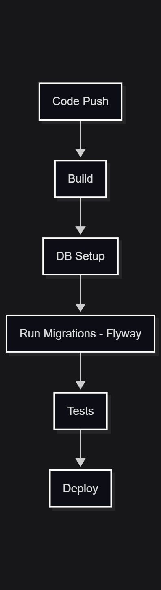

# Q1 Tools Analysis

## Tool 1: Flyway

### Overview
Flyway is a database migration tool that uses SQL-based versioned scripts to manage schema changes. Migrations are applied sequentially and tracked in a history table.

### Key Features
- SQL and Java-based migrations
- Version control for database schema
- Automatic migration execution
- Command-line and Docker support
- Tracks migration history

## Tool 2: Liquibase

### Overview
Liquibase is a database schema change management tool that uses XML, YAML, JSON, or SQL formats to define migrations. It provides database-independent change definitions.

### Key Features
- Multiple format support (XML, YAML, JSON, SQL)
- Database-agnostic changesets
- Automatic rollback generation
- Preconditions and context-based execution
- Change tracking via DATABASECHANGELOG table

## Comparison Table

| Feature | Flyway | Liquibase |
|---------|--------|-----------|
| **Ease of Use** | Simple, SQL-focused, low learning curve | Steeper learning curve, more complex |
| **CI/CD Integration** | Docker, CLI, direct integration | CLI, Maven, Gradle plugins |
| **Supported Databases** | MySQL, PostgreSQL, Oracle, SQL Server, 20+ total | MySQL, PostgreSQL, Oracle, SQL Server, 30+ total |

## CI/CD Integration Strategy

### Pipeline Steps

1. Checkout code
2. Start database service
3. Run migrations (Flyway)
4. Execute tests
5. Deploy application

### Diagram

The above pipeline stages should be executed sequentially via github actions

*Simple CICD pipeline stages*