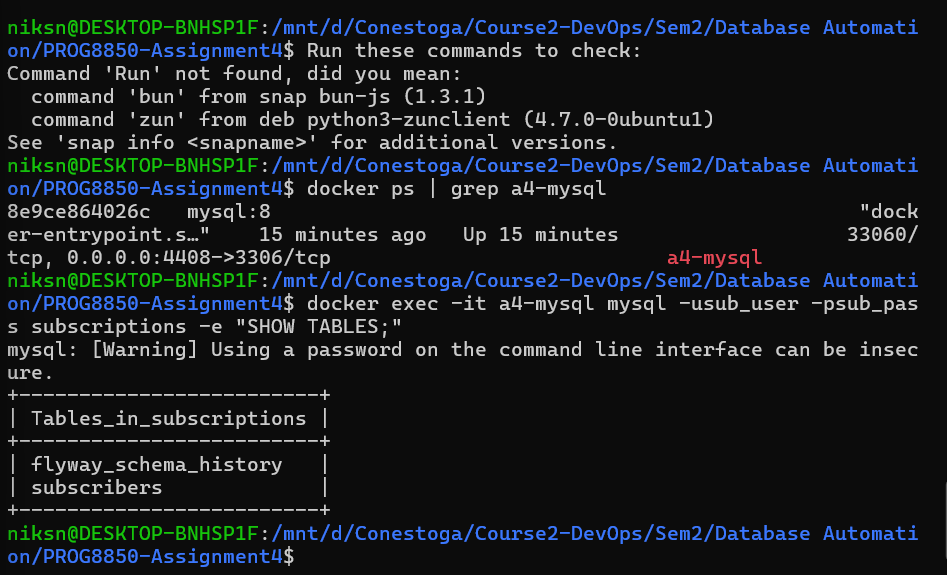
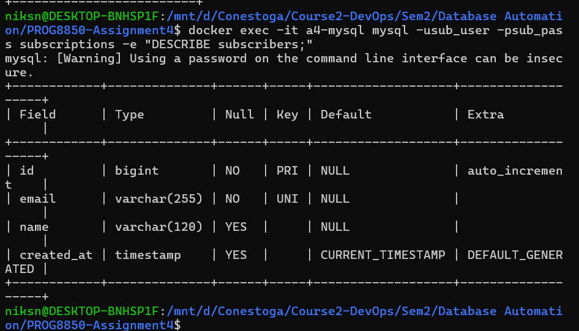
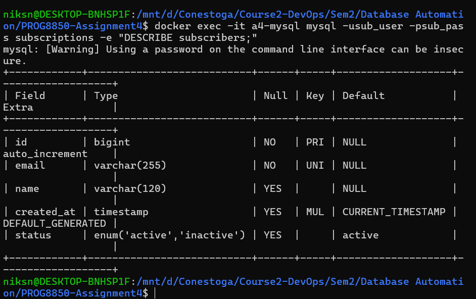
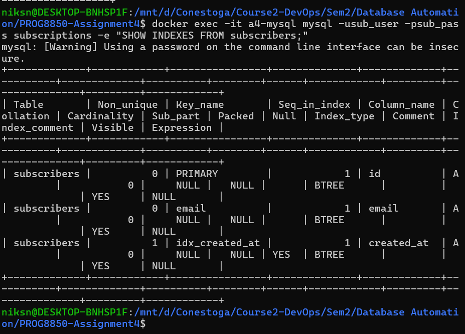
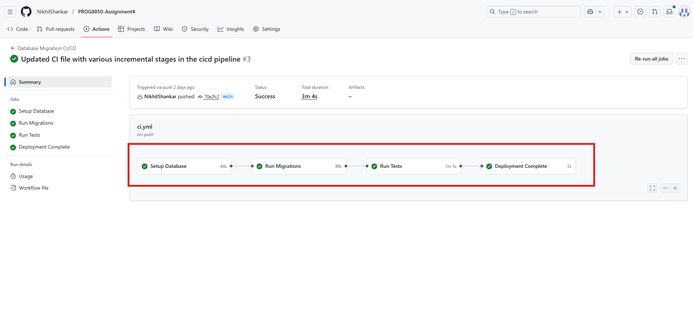
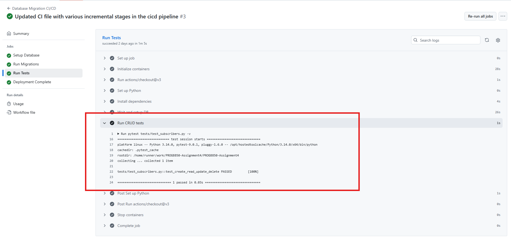
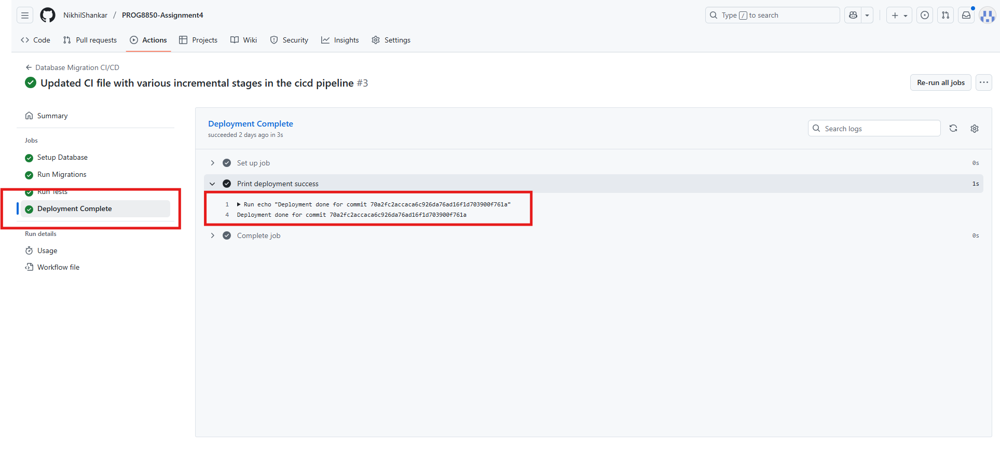

# Assignment 4 – Database Migrations with Flyway, Ansible & CI/CD
### Submitted by : Nikhil Shankar Chirakkal Sivasankaran ( **9026254** )

> Report for Question1 is created separately and named as ToolAnalysis.md and ToolAnalysis.pdf

### Q2 - Implementation (12 points)
- Ansible playbooks for environment management
- Flyway migrations (initial + incremental)
- GitHub Actions CI/CD workflow
- Automated CRUD tests

## Project Structure

```
PROG8850-Assignment4/
├── ansible/
│   ├── up.yml
│   └── down.yml
├── flyway/
│   ├── migrations_initial/
│   │   └── V1__create_subscribers.sql
│   └── migrations_incremental/
│       └── V2__add_status_and_index.sql
├── tests/
│   └── test_subscribers.py
├── .github/workflows/
│   └── ci.yml
└── requirements.txt
```

## Running Locally

### Prerequisites
- Docker Desktop
- Ansible (WSL)
- Python 3.x

### Start Environment

```bash
cd /mnt/d/Conestoga/Course2-DevOps/Sem2/Database\ Automation/PROG8850-Assignment4
ansible-playbook ansible/up.yml
```

### Verify Database

```bash
docker ps | grep a4-mysql
docker exec -it a4-mysql mysql -usub_user -psub_pass subscriptions -e "SHOW TABLES;"
docker exec -it a4-mysql mysql -usub_user -psub_pass subscriptions -e "DESCRIBE subscribers;"
```


*Db Created*


*Table Structure After Initial V1 migration*


*Table Structure After V2 migration*


*Index Created after V2 migration*

### Run Tests

```bash
pip install -r requirements.txt
DB_PORT=4408 pytest tests/test_subscribers.py -v
```

### Tear Down

```bash
ansible-playbook ansible/down.yml
```

## CI/CD Pipeline

**Stages:** Setup → Migrate → Test → Deploy

**Trigger:** Push to main/master

**Configuration:**
- MySQL 8 on port 4408
- Database: subscriptions
- User: sub_user / sub_pass
- Flyway 10


*All 4 stages in the pipeline getting passed*


*Python test cases running and passing in CICD workflow*


**Deployment Complete**
Once all stages in workflow is completed ie Deploy, migration and testing we print deployment completed for the appropriate commit.


*Deployment Completed Status after succesful completion of all stages in pipeline*

## Database Schema
### V1 - Initial Schema
- id (BIGINT, PK, auto_increment)
- email (VARCHAR(255), UNIQUE)
- name (VARCHAR(120))
- created_at (TIMESTAMP)

### V2 - Incremental Updates
- status (ENUM: active/inactive, default active)
- Index on created_at

## CRUD Tests

**Coverage:**
- CREATE: Insert subscriber
- READ: Retrieve by ID
- UPDATE: Modify name
- DELETE: Remove subscriber

**Environment Variables:**
- DB_HOST (default: 127.0.0.1)
- DB_PORT (default: 3306, use 4408 locally)
- DB_USER (default: root)
- DB_PASSWORD (default: rootpass)
- DB_NAME (default: subscriptions)


## Dependencies

**Python:**
- pymysql
- pytest

**Docker:**
- mysql:8
- flyway/flyway:10